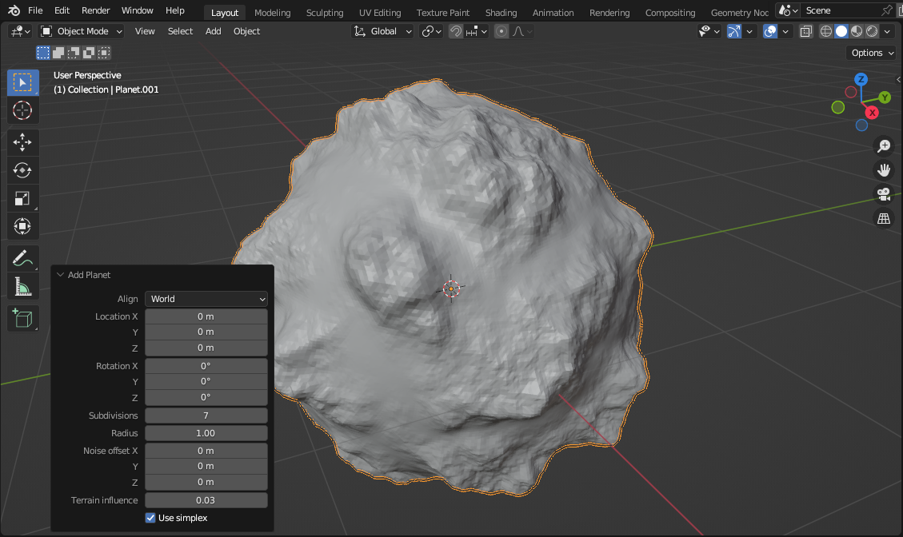

# pgen
Planet generator addon for blender 2.8+



# Build requirements
```
Installed blender
Python (same version as in blender)
Working C compiler
```

Caution: To remove the addon, you need to disable it first, then quit blender.
.pyd libraries aren't unloaded when disabling the plugin.

# Installing (windows)
1. Modify install.bat if building with MinGW
2. Launch and wait 2 mins

# Installing (other OS)
1. Build noise package (see instructions on github)
2. Make following archive:
```
pgen.zip
|  pgen/
|==|  __init__.py
|==|  lib/
|=====|  noise/
|========|  __init__.py
|========|  ...
|=====|  EGG-INFO/
|========|  ...
```
3. Install the add-on from the archive
